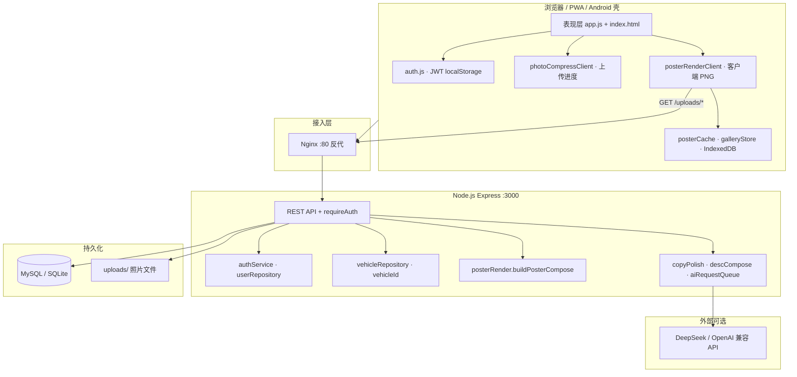
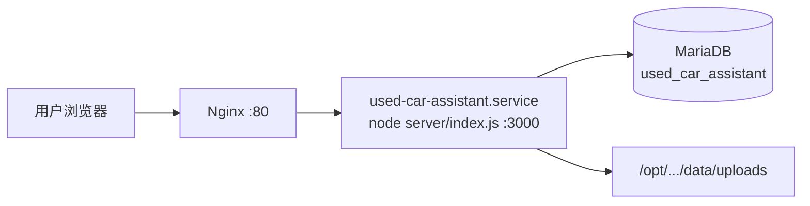
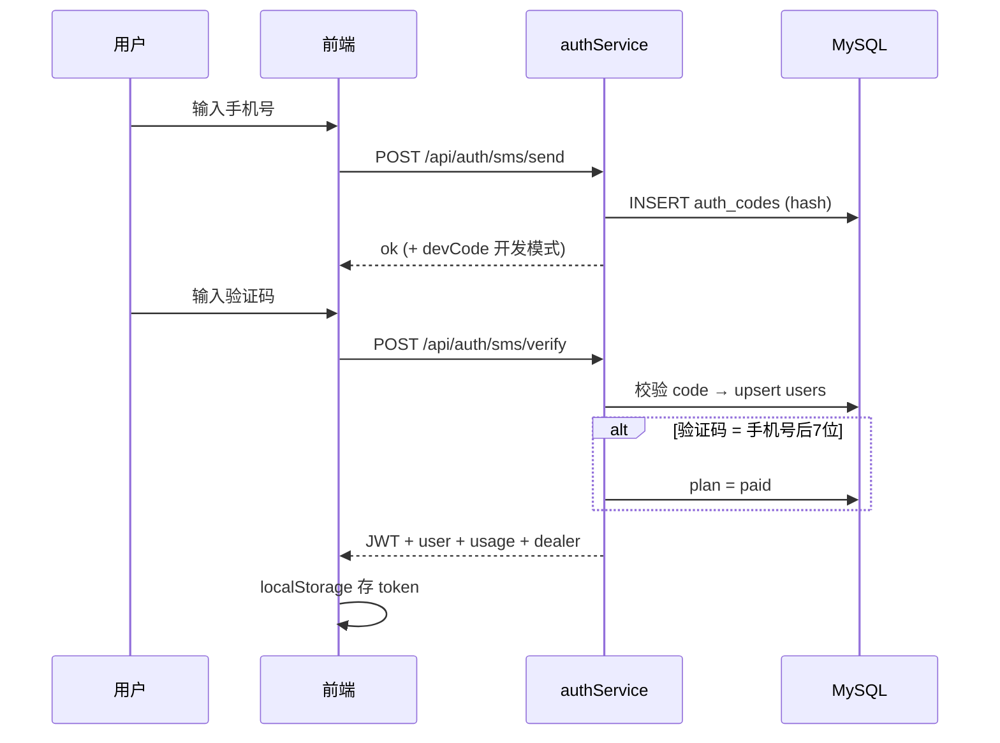
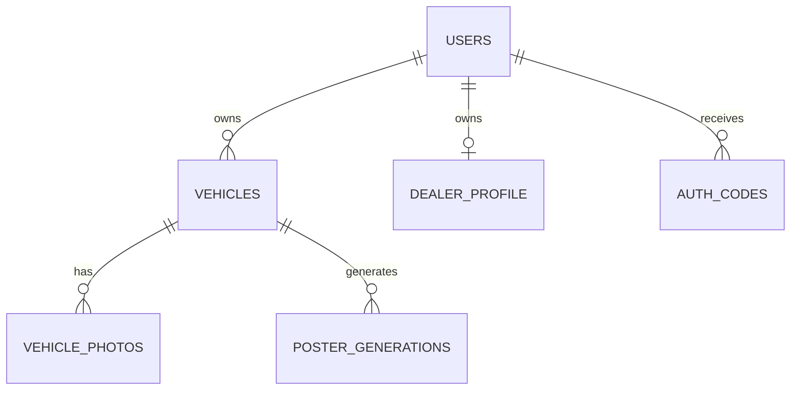
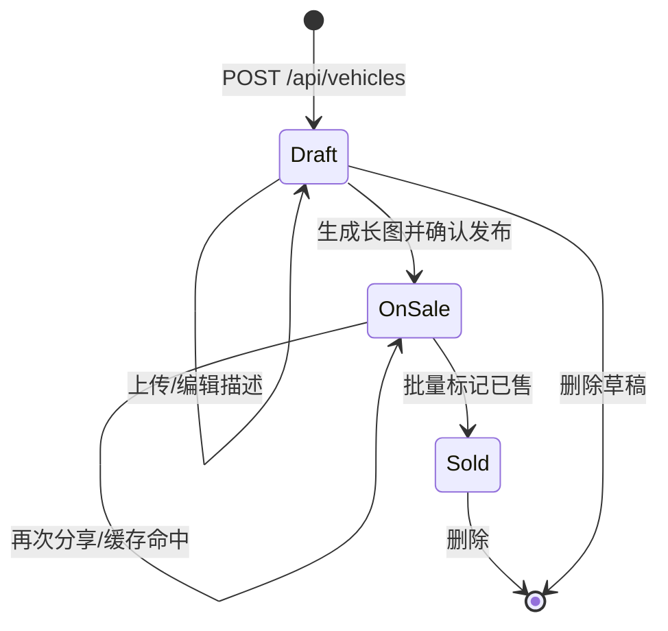
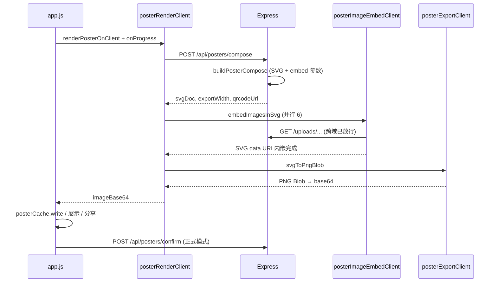

# 通用产品销售助手 — 系统架构设计

**版本**: v1.1  
**日期**: 2026-06-15  
**依据文档**: [二手车信息发布助手_RPD.md](./二手车信息发布助手_RPD.md)、[docs/开发更新日志.md](./docs/开发更新日志.md)  
**状态**: 生产可运行（Web H5 + PWA + Express + MySQL 多用户）

> 界面品牌为「通用产品销售助手」；后端 API、数据库表名仍保留 `vehicle` 等历史命名。

---

## 1. 文档目的与范围

本文档描述 **v1.1 已落地架构**，供开发、部署与备案参考，涵盖：

- 总体架构与生产部署拓扑
- 服务端 / 客户端模块划分与职责边界
- 多用户鉴权、试用配额与数据隔离
- 长图 **compose（服务端）+ PNG 导出（客户端）** 双阶段管线
- AI 文案、上传压缩、缓存等非功能设计

**专项文档**：

| 文档 | 路径 |
|------|------|
| API 契约 | [docs/API设计.md](./docs/API设计.md) |
| 数据库 DDL | [docs/数据库DDL.md](./docs/数据库DDL.md) |
| 长图 layoutSchema | [docs/长图layoutSchema规范.md](./docs/长图layoutSchema规范.md) |
| 埋点字典 | [docs/埋点字典.md](./docs/埋点字典.md) |
| 开发更新日志 | [docs/开发更新日志.md](./docs/开发更新日志.md) |
| 网络备案说明 | [docs/备案文档/网络备案功能说明.md](./docs/备案文档/网络备案功能说明.md) |

可运行前端：`public/index.html`；早期原型：`prototype.html`。

---

## 2. 架构目标与约束

### 2.1 业务目标

| 目标 | 架构含义 |
|------|----------|
| 快速完成产品宣传长图 | 预览降采样 + IndexedDB 缓存 + 客户端 PNG 导出 |
| 录入 → 文案 → 长图 → 分享闭环 | 线性向导 + Tab 导航；状态机 `draft/on_sale/sold` |
| 多产品超长图 | 服务端 SVG 区块拼接；客户端并行嵌入图片 |
| 多商户 SaaS 化工具 | 手机号登录；`user_id` 行级隔离；试用与付费配额 |
| 私域传播 | Web Share / 下载 PNG；非微信 SDK 原生发圈 |

### 2.2 技术约束

| 约束 | 说明 |
|------|------|
| 运行环境 | Node.js ≥ 18；浏览器移动端优先；可选 Capacitor Android 壳 |
| 数据库 | 本地 SQLite；生产 **MySQL / MariaDB** |
| 长图 PNG | **不在服务端落盘**；compose 返回 SVG + 参数，终端栅格化 |
| 照片 | 上传至 `data/uploads/vehicles/{id}/`，按用户隔离访问 |
| AI | DeepSeek 等 OpenAI 兼容 API；无 Key 时本地模板降级；统一排队 |

---

## 3. 总体架构

### 3.1 逻辑架构（当前 v1.1）

采用 **「B/S 多租户工具 + 客户端重计算」**：业务数据与照片在服务端；长图 PNG 栅格化、图片预压缩、IndexedDB 缓存在浏览器完成。



### 3.2 与早期方案的差异

| 项 | 早期规划（RPD / v1.0） | 当前 v1.1 |
|----|------------------------|-----------|
| 数据位置 | 端侧 SQLite 为主 | 服务端 MySQL + 上传目录 |
| 长图渲染 | 服务端 resvg 出 PNG | 服务端 **仅 compose SVG**；客户端导出 PNG |
| 用户模型 | 单用户 / 无登录 | 手机号 + JWT；多租户隔离 |
| 识图 | 百度识图（已取消） | 手填产品名 |
| 分享 | 微信 SDK | Web Share API + 下载兜底 |

### 3.3 部署拓扑（生产）



| 组件 | 说明 |
|------|------|
| 进程管理 | systemd `used-car-assistant.service` |
| 反向代理 | Nginx → `127.0.0.1:3000`；`client_max_body_size 10m` |
| 应用目录 | `/opt/used-car-assistant`（`public/`、`server/`、`assets/`、`node_modules/`） |
| 配置 | `.env`：`MYSQL_*`、`AUTH_SECRET`、`PUBLIC_BASE_URL`、`VISION_API_*`、`AI_QUEUE_*` |
| 打包 | `npm run pack` → `dist/used-car-assistant-1.1.0-linux-x64-*.tar.gz` |
| 同步 | `scripts/sync-production.sh`（`DEPLOY_HOST` 可指定服务器） |

| 形态 | 状态 | 说明 |
|------|------|------|
| Web H5 | ✅ 主形态 | `public/` 静态资源 + ES Module |
| PWA | ✅ | `manifest.webmanifest`、`sw.js`（缓存壳 v2） |
| Capacitor Android | ✅ | `android/`；`config.js` 可指向远程 API |
| 原生 Flutter/RN | 未实施 | 二期可选 |

---

## 4. 服务端架构

### 4.1 分层与入口

```
server/index.js          # Express 路由、Multer 上传、静态资源、错误处理
    ├── db.js            # 初始化：SQLite / MySQL 适配器 + 迁移 001–004
    ├── db/sqliteAdapter.js
    ├── db/mysqlAdapter.js   # 连接池 MYSQL_CONNECTION_LIMIT
    └── services/        # 领域服务（见下表）
```

### 4.2 服务模块映射

| 模块 | 文件 | 职责 |
|------|------|------|
| 认证 | `authService.js` | 短信验证码、JWT 签发/校验、`requireAuth` 中间件 |
| 用户 | `userRepository.js` | 注册、试用天数、产品配额、付费 `plan=paid` |
| 产品 | `vehicleRepository.js` | CRUD、筛选、批量操作；**按 `user_id` 过滤** |
| 编号 | `vehicleId.js` | `CCyyyyMMddHHmmNNN` 事务发号 |
| 经销商 | `dealerProfile.js` | 每用户一条联系信息 + 二维码路径 |
| 卖点 | `sellingEngine.js` | 内置卖点库关键词推荐 |
| AI 文案 | `copyPolish.js` | 润色、卖点生成；LLM + 本地降级 |
| 描述合成 | `descCompose.js` | 卖点并入正文、售价追加、`buildPosterDescription` |
| 描述提取 | `descExtract.js` | 从自由文本抽取结构化字段（走 AI 队列） |
| AI 队列 | `aiRequestQueue.js` | 并发上限、排队上限、等待超时 |
| 长图 compose | `posterRender.js` | 读模板 → 拼 SVG 文档（**不栅格化 PNG**） |
| 长图嵌入（服务端） | `posterImageEmbed.js` | CLI/兼容路径；Web 主流程在客户端嵌入 |
| 生成记录 | `posterGenerationRepository.js` | `poster_generations` 元数据 |
| 字体/文本 | `posterFonts.js`、`posterText.js` | 导出字体、电话 SVG 文本 |
| 埋点 | `analytics.js` | 写入 `analytics_events` |
| 导出（CLI） | `posterRenderWorker.js`、`scripts/render-poster-cli.js` | 离线/测试用服务端 PNG |

### 4.3 API 分组与鉴权

| 分组 | 鉴权 | 代表路径 |
|------|------|----------|
| 健康 / 模板 | 否 | `GET /api/health`、`GET /api/templates` |
| 认证 | 否 | `POST /api/auth/sms/send|verify` |
| 业务 | **Bearer JWT** | `/api/vehicles*`、`/api/posters/compose`、`/api/dealer*` |
| 静态 | 否 | `/`、`/uploads/*`、`/assets/*` |

**配额拦截**：`POST /api/vehicles` 创建时检查 `TRIAL_EXPIRED` / `PRODUCT_LIMIT_REACHED`。

**已废弃**：`POST /api/posters/render` 返回 `410 SERVER_RENDER_DISABLED`；Web 统一走 compose + 客户端渲染。

---

## 5. 客户端架构

### 5.1 模块结构（`public/js/`）

| 模块 | 文件 | 职责 |
|------|------|------|
| 应用编排 | `app.js` | 页面状态、录入流、列表、分享、登录 UI |
| API 客户端 | `api.js` | fetch 封装、JWT Header、上传 XHR 进度 |
| 认证 | `auth.js` | token 读写、`getAuthHeaders` |
| 配置 | `config.js` | 同源 / APK 远程 `SERVER_URL` |
| 长图渲染 | `posterRenderClient.js` | compose → embed → PNG → base64 |
| 嵌入 | `posterImageEmbedClient.js` | 6 路并发 + LRU 缓存 |
| PNG 导出 | `posterExportClient.js` | Canvas / Blob 栅格化 |
| 图片工具 | `imageClientUtils.js`、`asyncUtils.js` | decode、dataURI、并发 map |
| 进度 | `posterProgress.js` | 0–98% 阶段上报；98.1–99.9% 等待动画 |
| 上传压缩 | `photoCompressClient.js` | 预压缩、流水线、并行 |
| 上传进度 | `photoUploadProgress.js` | 槽位 + 全局进度条 |
| 缓存 | `posterCache.js` | IndexedDB 长图缓存（24 条） |
| 图库 | `galleryStore.js` | 多车合集 IndexedDB（100 条） |
| 保存分享 | `posterSave.js` | Web Share、下载、Capacitor |
| PWA | `pwa.js`、`sw.js` | Service Worker 静态壳 |

### 5.2 页面与导航

| 页面 ID | 名称 | 入口 |
|---------|------|------|
| `page-list` | 我的产品 | Tab「产品」 |
| `page-upload` | 上传照片 | 「+ 录入」/ Tab「拍照」 |
| `page-desc` | 描述 + 售价 + AI 卖点 | 上传完成后 |
| `page-template` | 模板与长图预览 | 描述确认后 |
| `page-gallery` | 图库 | Tab「图库」 |
| `page-profile` | 我的（登录、配额、联系信息） | Tab「我的」 |

**录入流**：`FLOW_PAGES = ['page-desc', 'page-template']`  
**上传步骤文案**：外观 / 细节 / 补充（13 槽位；支持「一次选多张」）。

### 5.3 客户端分层（逻辑）

```
┌─────────────────────────────────────────────────────────┐
│  Presentation   index.html + app.css + Tab/Navbar       │
├─────────────────────────────────────────────────────────┤
│  Application    app.js（用例：录入、生图、分享、批量）    │
├─────────────────────────────────────────────────────────┤
│  Domain 模块    posterRenderClient / posterCache / …    │
├─────────────────────────────────────────────────────────┤
│  Infrastructure api.js · auth.js · config.js · pwa.js    │
└─────────────────────────────────────────────────────────┘
```

---

## 6. 认证与多租户

### 6.1 登录流程



| 项 | 规则 |
|----|------|
| 验证码 | 6 位；SHA-256 存库；5 分钟有效；前端 60 秒重发倒计时 |
| JWT | HMAC-SHA256；payload 含 `userId`、`exp`；默认 30 天 |
| 试用 | 注册起 20 天；最多 40 个产品 |
| 付费 | `plan=paid` → `unlimited`；不删已有产品 |
| 隔离 | 所有 `vehicles`、`dealer_profile` 查询带 `user_id` |

### 6.2 数据隔离模型



详见 [docs/数据库DDL.md](./docs/数据库DDL.md) §3.11（Schema v4）。

---

## 7. 核心业务流程

### 7.1 产品状态机



### 7.2 长图生成端到端（v1.1 主路径）



**进度映射**（`posterProgress.report`）：

| 阶段 | 进度 | 说明 |
|------|------|------|
| compose 请求 | 8% → 25% | 加载产品与模板 |
| 图片嵌入 | 28% → 82% | 按 `done/total` 线性插值 |
| PNG 导出 | 85% → 96% | 栅格化 + base64 |
| 收尾 | 98% → 99.9% | 等待动画至完成 |
| complete | 100% | 成功态 |

### 7.3 AI 文案流程

```
用户输入描述
  → POST /api/selling-points/generate（aiRequestQueue.run）
  → copyPolish → DeepSeek JSON / localGenerateSellingPoints
  → 前端点选卖点 → descCompose.mergeSellingIntoDescription
  → POST /api/polish（队列）→ 润色正文
  → descCompose.buildPosterDescription → 长图车况介绍区块
```

队列参数：`AI_QUEUE_CONCURRENCY`（默认 3）、`AI_QUEUE_MAX`（30）、`AI_QUEUE_WAIT_MS`（120000）。

---

## 8. 长图渲染子系统

### 8.1 双阶段设计

| 阶段 | 位置 | 输入 | 输出 |
|------|------|------|------|
| **Compose** | 服务端 `posterRender.buildPosterCompose` | vehicles、templateId、dealer、previewMode | SVG 字符串、embed 参数、宽高、blockCount |
| **Embed** | 客户端 `posterImageEmbedClient` | svgDoc、/uploads URL | SVG（data URI 内嵌图） |
| **Rasterize** | 客户端 `posterExportClient` | SVG Blob | PNG Blob |

**预览模式**：`exportWidth` ≤ 375；嵌入 `maxEdge` 较小；不写 `poster_generations`。  
**正式模式**：宽度可达 1242px；`POST /api/posters/confirm` 写元数据并更新 `hasPoster`。

### 8.2 模板系统

- 配置：`assets/templates/*.json`（layoutSchema）
- 区块：头图、编号、卖点、产品描述（含售价）、照片网格、多车分割线、页脚（联系信息 + 二维码）
- 规范：[docs/长图layoutSchema规范.md](./docs/长图layoutSchema规范.md)
- 字体：`assets/fonts/`（如 STHeiti）；服务端 `ensurePosterFonts()`

### 8.3 服务端 PNG 路径（保留）

`renderPosterToBuffer` + `posterRenderWorker` 仍可用于 CLI、集成测试；**Web 生产路径已切换为客户端渲染**，以降低服务器 CPU 与内存峰值。

---

## 9. 上传与图片处理

### 9.1 上传管线

```
用户选图
  → photoCompressClient（客户端压缩、跳过已优化 JPEG）
  → FormData → POST /api/vehicles/:id/photos
  → Multer memoryStorage → sharp 校验/写入
  → data/uploads/vehicles/{vehicleId}/{uuid}.jpg
  → vehicle_photos 表记录 category + slotKey
```

| 项 | 说明 |
|----|------|
| 大小限制 | 单张 5MB（Multer）；二维码 2MB |
| 进度 | XHR `upload.onprogress` + 槽位遮罩 |
| 批量 | `distributePhotosToSlots` 按外观→细节→补充 13 槽填充 |
| CORS | `/uploads` 允许跨域，供客户端 embed 拉取 |

### 9.2 未实现（RPD 原规划）

裁切、滤镜、水印拖拽 — 当前 MVP 未包含。

---

## 10. 存储架构

### 10.1 分层总览

| 层级 | 技术 | 内容 |
|------|------|------|
| 结构化数据 | SQLite / **MySQL** | users、vehicles、photos、dealer、poster_generations、analytics |
| 产品照片 | 文件系统 | `data/uploads/vehicles/{id}/` |
| 经销商二维码 | 文件系统 | `data/uploads/dealer/` |
| 长图 PNG | **不持久化于服务端** | API/客户端 Base64；IndexedDB 缓存 |
| 多车图库 | IndexedDB | `used-car-gallery-v1`，命名 `YYYYMMDD-NN` |
| 长图缓存 | IndexedDB | `used-car-poster-cache-v1`，最多 24 条 |
| 登录态 | localStorage | `uca_auth_token` |
| 模板/字体 | 静态资源 | `assets/templates/`、`assets/fonts/` |

### 10.2 Schema 版本

| 版本 | 迁移 | 要点 |
|------|------|------|
| v1 | 001 | 初始表 |
| v2 | 002 | 草稿 `code` 可空 |
| v3 | 003 | poster_generations |
| v4 | 004 | users、auth_codes、user_id 列 |

### 10.3 备份策略（生产）

同时备份 **MySQL 全库** 与 **`data/uploads/`** 目录。

---

## 11. 分享、PWA 与终端形态

### 11.1 分享（share-bridge）

| 能力 | 实现 |
|------|------|
| 分享图片 | `posterSave.sharePosterImage` → Web Share API（`files: [png]`） |
| 保存 | 下载链接 / Capacitor Filesystem + Share |
| 文案 | `POST /api/share/default-copy` 预填；用户自行粘贴至微信 |
| 记录 | `POST /api/share`；更新统计 |

**说明**：未接入微信 Open SDK；朋友圈发布由用户在本机完成。

### 11.2 PWA

- `manifest.webmanifest`：`standalone`、竖屏、主题色 `#07C160`
- `sw.js`：缓存静态壳（`uca-shell-v2`）；API 与 uploads 走网络
- `pwa.js`：注册 SW、安装提示

### 11.3 Capacitor Android

- `capacitor.config.json` + `android/` 工程
- `config.js`：`isNativeApp()` 时默认连配置的生产 API 地址
- 构建：`npm run android:build`

---

## 12. 非功能需求对策

| 类别 | 目标 | v1.1 对策 |
|------|------|-----------|
| 长图速度 | 预览秒级 | 375px preview + debounce 280ms + AbortController |
| 长图速度 | 正式可接受 | 客户端并行 embed(6) + LRU；服务端不做 PNG |
| 上传 | 大图慢 | 客户端预压缩 + 并行预压 + 进度反馈 |
| AI 峰值 | 不压垮服务 | aiRequestQueue 并发/队列/超时 |
| DB 并发 | 多用户 | MySQL 连接池 `MYSQL_CONNECTION_LIMIT=20` |
| 离线 | 弱网 | PWA 静态壳；业务需联网 |
| 缓存 | 重复生图 | IndexedDB key 含模板 + 内容版本 |

---

## 13. 安全与隐私

| 项 | 措施 |
|----|------|
| 鉴权 | 业务 API 默认 JWT；`AUTH_SECRET` 生产必改 |
| 验证码 | 哈希存储；开发模式 `AUTH_DEV_MODE` 返回 devCode |
| 租户隔离 | SQL 层 `user_id`；`loadOwnedVehicle` 校验归属 |
| 上传 | 类型校验；大小限制；路径 UUID |
| LLM | 仅文本出网；HTTPS；Key 在服务端 `.env` |
| 内容 | 无公开 UGC 广场；用户内容仅本人可见 |
| 传输 | 生产建议 HTTPS（备案域名 + 证书） |

备案相关说明见 [docs/备案文档/网络备案功能说明.md](./docs/备案文档/网络备案功能说明.md)。

---

## 14. 可观测性

| 手段 | 说明 |
|------|------|
| 健康检查 | `GET /api/health` → version、db、aiQueue 统计 |
| 埋点 | `analytics.track` → `analytics_events` 表 |
| 日志 | `[auth] 验证码` 开发日志；systemd `journalctl -u used-car-assistant` |
| 字典 | [docs/埋点字典.md](./docs/埋点字典.md) |

---

## 15. 技术选型（已落地）

| 层次 | 选型 |
|------|------|
| 前端 | 原生 ES Module + CSS（无 React/Vue 框架） |
| 后端 | Node.js 20 + Express 4 |
| 数据库 | better-sqlite3（本地）/ mysql2 连接池（生产） |
| 图片 | sharp（服务端）、Canvas/Blob（客户端） |
| 长图 | layoutSchema JSON + SVG；客户端 PNG 导出 |
| AI | OpenAI 兼容 Chat Completions（DeepSeek） |
| 部署 | Nginx + systemd + MariaDB |
| 移动壳 | Capacitor 6 |
| 测试 | Node 脚本集成测试（`npm test`） |

---

## 16. 版本演进

### 16.1 已实现（v1.1.0）

- ✅ 多用户登录、试用、付费、数据隔离
- ✅ 产品 CRUD、编号、三步上传、批量选图
- ✅ 描述页 AI 卖点 + 润色 + 售价合成
- ✅ 长图 compose + **客户端 PNG** + 进度动画
- ✅ IndexedDB 缓存 + 多车图库
- ✅ 经销商资料 + 二维码 + 分享/保存
- ✅ PWA + Android 壳 + 打包部署脚本
- ✅ AI 请求队列、上传/嵌入性能优化
- ❌ 车型识图（已移除）
- ⏳ 裁切/滤镜/水印拖拽
- ⏳ 微信 SDK 原生分享

### 16.2 后续可选

| 方向 | 说明 |
|------|------|
| HTTPS + 备案域名 | 生产合规与 PWA 能力增强 |
| 短信网关 | 替换开发模式 devCode |
| 服务端渲染降级 | 低端机 Canvas 失败时可选 compose + server PNG |
| 远程模板 | 签名下发 layoutSchema |
| 原生 App | Flutter/RN 替换 H5 以优化 rasterize 性能 |

---

## 17. 架构风险与对策

| 风险 | 对策 |
|------|------|
| 客户端 PNG 内存峰值 | 预览降采样；限制单次多车数量；AbortController 取消 |
| Canvas 兼容性 | Safari/iOS 专项测试（`safari-browser-test.js`） |
| AI 队列满 | 503 + `AI_QUEUE_FULL`；前端 toast 重试 |
| 试用滥用 | 手机号注册 + 产品上限 + 试用天数 |
| 上传占满磁盘 | 监控 `data/uploads`；按用户配额（二期） |
| 文档与代码漂移 | 变更同步 [开发更新日志](./docs/开发更新日志.md) |

---

## 18. 附录

### 18.1 目录结构（仓库）

```
通用助手/
├── public/                 # 前端静态资源 + JS 模块
├── server/                 # Express 入口与服务
│   ├── index.js
│   ├── db.js
│   ├── migrations/         # 001–004
│   └── services/
├── assets/templates/       # 长图模板 JSON
├── assets/fonts/           # 中文字体
├── data/                   # 运行时 DB + uploads（gitignore）
├── docs/                   # 技术文档
│   └── 备案文档/
├── tests/                  # 自动化测试
├── scripts/                # 部署、打包
├── android/                # Capacitor
├── dist/                   # 打包产物
└── package.json            # version 1.1.0
```

### 18.2 关键环境变量

| 变量 | 用途 |
|------|------|
| `DB_DRIVER` | `sqlite` / `mysql` |
| `MYSQL_*` | 生产数据库 |
| `AUTH_SECRET` | JWT 签名 |
| `AUTH_DEV_MODE` | 开发验证码回显 |
| `PUBLIC_BASE_URL` | 对外 URL、资源绝对路径 |
| `VISION_API_*` | LLM 文案 |
| `AI_QUEUE_*` | AI 并发与排队 |

完整示例：`.env.example`。

### 18.3 文档交叉引用

| 主题 | 文档 |
|------|------|
| REST 接口 | [API设计.md](./docs/API设计.md) |
| 表结构 | [数据库DDL.md](./docs/数据库DDL.md) |
| 变更记录 | [开发更新日志.md](./docs/开发更新日志.md) |
| 需求范围 | [RPD](./二手车信息发布助手_RPD.md) |
| 备案 | [网络备案功能说明.md](./docs/备案文档/网络备案功能说明.md) |

---

*文档结束 — 与代码版本 v1.1.0 对齐*
